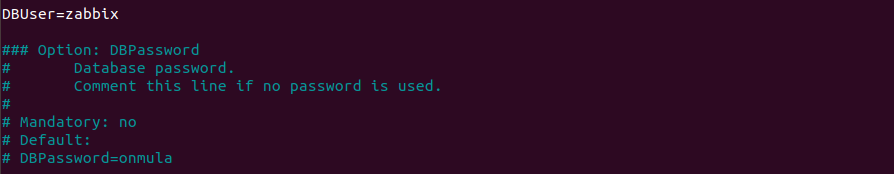
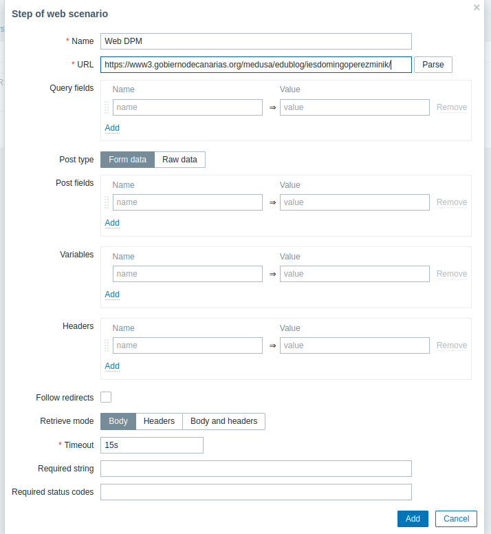

# Zabbix

## Instalar Zabbix

1º Introducir el siguiente código

```bash
  wget wget https://repo.zabbix.com/zabbix/4.2/ubuntu/pool/main/z/zabbix-release/zabbix-release_4.2-1+bionic_all.deb
```

Aparecera algo asi


2º Instalar el paquete

```bash
	sudo dpkg -i zabbix-release_4.2-1+bionic_all.deb
```

Aparecera algo asi


3º Instalamos otro de los paquetes necesarios para Zabbix

```bash
	sudo apt install -y zabbix-server-mysql zabbix-frontend-php zabbix-agent
```

Aparecera algo asi


4º Entramos en sql para configurarlo

```bash
	mysql -uroot -p
```

Aparecera algo asi


5º Creamos la base de datos de nuesto servicio de monitarización:

```ini
	create database zabbix character set utf8 collate utf8_bin;
```

Aparecera algo asi


6º Ponemos el siguiente comando , en el cual ponemos el usuario y la contraseña:

```ini
	grant all privileges on zabbix.* to zabbix@localhost identified by 'password';
```

Aparecera algo asi


7º Salimos de MariaDB

```bash
	quit
```

Aparecera algo asi


8º

```bash
	sudo zcat /usr/share/doc/zabbix-server-mysql*/create.sql.gz | mysql -uzabbix -p zabbix
```

Aparecera algo asi



9º Editamos el archivo /etc/zabbix/zabbix_server.conf y modificamos las siguientes propiedades

```ini
	DBUser=zabbix
	DBPassword=password
```

10º

```ini-- 
	<IfModule mod_php5.c>
    php_value max_execution_time 300
    php_value memory_limit 128M
    php_value post_max_size 16M
    php_value upload_max_filesize 2M
    php_value max_input_time 300
    php_value max_input_vars 10000
    php_value always_populate_raw_post_data -1
    php_value date.timezone Europe/London			<--- Añadimos esta línea(Aparecera como comentario)
</IfModule>
<IfModule mod_php7.c>
    php_value max_execution_time 300
    php_value memory_limit 128M
    php_value post_max_size 16M
    php_value upload_max_filesize 2M
    php_value max_input_time 300
    php_value max_input_vars 10000
    php_value always_populate_raw_post_data -1
    php_value date.timezone Europe/London			<--- Añadimos esta línea(Aparecera como comentario)
</IfModule>
```


11º

```bash
	sudo systemctl restart zabbix-server zabbix-agent apache2
```


12º

```bash
	sudo systemctl enable zabbix-server zabbix-agent apache2
```


13º Nos dirigimos al navegador e introducimos  [http://localhost/zabbix](http://localhost/zabbix)

Nos saldra una ventana tal que asi :


14º Le damos al boton de siguiente


15º En Password pondremos la contraseña que indicamos anteriormente en los pasos 6 y 9. 


16º Iniciamos sesion con usuario "Admin" y contraseña "zabbix" 

## Monitorizar un equipo con Zabbix

1º Depende de que tipo de equipo tengas tenemos que seguir unos pasos u otros. En este caso lo haremos en un ubuntu.
El primer paso a seguir es poner es el siguiente comando para instalar los paquetes de los agentes que enviaran los datos de este equipo al servidor zabbix:

```bash
	wget https://repo.zabbix.com/zabbix/5.2/ubuntu/pool/main/z/zabbix-release/zabbix-release_5.2.1+ubuntu20.04_all.deb
```

 2º Deberemos configurar el agente para ello tendremos que abrir el fichero de configuracion del agente

 ```bash
	sudo nano /etc/zabbix/zabbix_agentd.conf
```

3º Modificamos las direcciones ip de nuestro servidor y guardamos los cambios

```ini
Server=192.168.233.128
ServerActive=192.168.233.128
```
 
 4º Ponemos los siguientes comandos para que se apliquen los cambios y que se inicie justamente al iniciar el equipo

  ```bash
sudo systemctl restart zabbix-agent 
sudo systemctl enable zabbix-agent
```

5º Nos vamos a nuestro servidor zabbix y nos vamos al apartado de Configuracion y dentro de el al subapartado de hosts y configuramos el host con los datos de nuestra maquina. En mi caso tuve que poner los siguientes datos mostrados en las siguientes imagenes:


6º Y por ultimo tendremos que esperar unos minutos y despues podremos y al apartado de monitoring y graph para ver los datos como se pueden observar en la siguiente imagen:


## Monitorizar un Servicio con Zabbix

1º Nos dirigimos al apartado de configuracion y subapartado de hosts y en el host de zabbix (en el que nos encontramos) le damos a la ventana de Items


2º Dentro de items le damos al boton de create item


3º Rellenamos los campos necesarios , yo por ejemplo hice una monitorizacion de squid.


4º Y por ultimo le damos al apartado de monitorizacion y latest data para ver los datos obtenidos


## Monitorizar una Pagina web con Zabbix

1º Nos vamos al apartado de configuracion y subapartado de host y le damos a web


2º Dentro de web deberemos darle al boton de "create a web scene"


3ºDonde pone pasos tendremos que añadir los datos de la pagina web que vamos a monitorizar 




4º Despues de crear la escena si hacemos click en web y en la escena que hemos creado podemos observar los datos de la pagina web como se observa.


